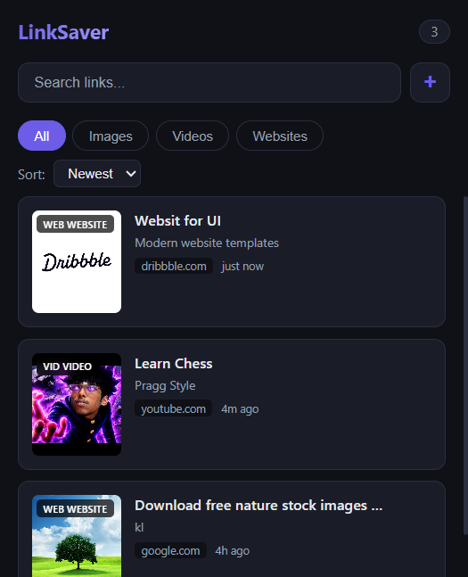
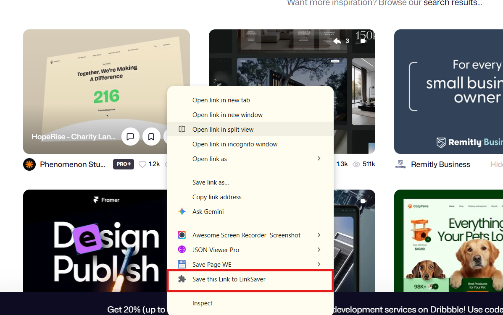
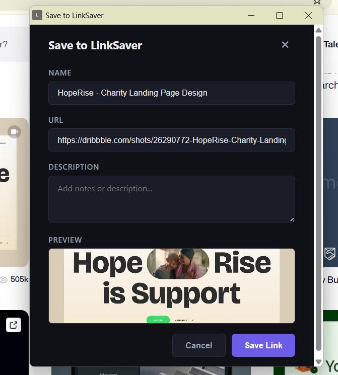

# LinkSaver

Save, organize, and preview links with automatic thumbnails — directly from your right-click menu.


*Main popup with filters, search, and link cards*

## Features

- **Right-click save** — Save links, pages, or images via context menu
- **Organized view** — Filter by type (All / Images / Videos / Websites), sort by date or name, search by keyword
- **Auto previews** — Shows the actual image for image links, YouTube/Vimeo thumbnails for videos, and Open Graph / Twitter Card images for websites
- **Favicon fallback** — When no preview is available, the site favicon is shown
- **Dark theme** — Clean, modern dark UI

## Screenshots

### Context Menu


*Right-click on any link, page, or image to save*

### Save Dialog


*Add a name and description before saving*

### Popup View


*Browse, search, filter, and manage your saved links*

## How to Install

1. Open `chrome://extensions`
2. Enable **Developer mode** (top right)
3. Click **Load unpacked**
4. Select the extension folder

## Usage

| Action | How |
|---|---|
| Save a link | Right-click a link → *Save this Link to LinkSaver* |
| Save current page | Right-click empty page area → *Save this Page to LinkSaver* |
| Save an image | Right-click an image → *Save this Image to LinkSaver* |
| View saved links | Click the extension icon in the toolbar |
| Open a link | Click any card in the popup |
| Copy URL | Hover over a card → Click the copy button |
| Delete a link | Hover over a card → Click the delete button |

## Permissions

- `contextMenus` — Add right-click menu items
- `storage` — Save links locally in your browser
- `tabs` — Open saved links in new tabs
- `<all_urls>` — Fetch page previews (Open Graph images)

## Structure

```
LinkSaver/
├── manifest.json       # Extension config
├── background.js       # Service worker — context menus & preview fetching
├── popup.html          # Main popup UI
├── popup.js            # Popup logic — filter, search, sort, render
├── save.html           # Save dialog UI
├── save.js             # Save dialog logic
└── styles.css          # Dark theme styles
```
